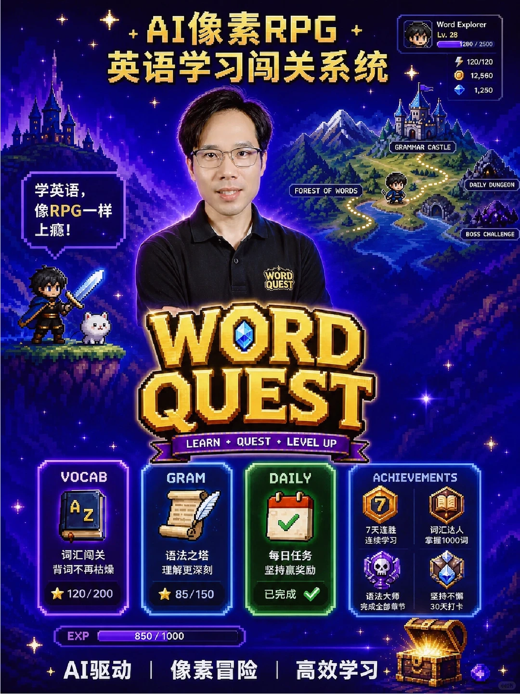

---
title: "我做了一个英语学习RGP闯关系统"
source: "https://www.xiaohongshu.com/discovery/item/6a64544d0000000001001f71?app_platform=android&ignoreEngage=true&app_version=9.39.0&share_from_user_hidden=true&xsec_source=app_share&type=video&xsec_token=CBz0ZH6zJnvrOGnbhMJvn2JdiCtrMv9XKILvx9mS-yM6w%3D&author_share=1&xhsshare=CopyLink&shareRedId=N0dINjg3NUpMPko6S0EySDs0P0lFSjdL&apptime=1784991084&share_id=04903ae1dd594d84b415782633f11f0f&share_channel=copy_link"
author: "来宝AI"
author_uid: "6a210c100000000001007401"
date: "4小时前 浙江"
tags: ["AI玩法", "vibecoding", "英语学习", "林曜AI", "AI应用", "RPG闯关", "像素风格", "学习游戏化"]
platform: "xiaohongshu"
category: "AI"
summary: "作者制作了一款像素RPG风格的英语学习应用，将枯燥的语言学习转化为冒险闯关体验。系统涵盖词汇闯关、语法之塔、每日任务等模块，通过答题获得经验值和升级奖励，支持连胜、打卡等成就机制，让背单词像打游戏一样上瘾。应用结合AI驱动，实现高效且富有乐趣的英语学习过程。"
---

# 我做了一个英语学习RGP闯关系统

> 作者: 来宝AI | 日期: 4小时前 浙江 | 原文: https://www.xiaohongshu.com/discovery/item/6a64544d0000000001001f71?app_platform=android&ignoreEngage=true&app_version=9.39.0&share_from_user_hidden=true&xsec_source=app_share&type=video&xsec_token=CBz0ZH6zJnvrOGnbhMJvn2JdiCtrMv9XKILvx9mS-yM6w%3D&author_share=1&xhsshare=CopyLink&shareRedId=N0dINjg3NUpMPko6S0EySDs0P0lFSjdL&apptime=1784991084&share_id=04903ae1dd594d84b415782633f11f0f&share_channel=copy_link

> **摘要**:作者制作了一款像素RPG风格的英语学习应用，将枯燥的语言学习转化为冒险闯关体验。系统涵盖词汇闯关、语法之塔、每日任务等模块，通过答题获得经验值和升级奖励，支持连胜、打卡等成就机制，让背单词像打游戏一样上瘾。应用结合AI驱动，实现高效且富有乐趣的英语学习过程。

像素RPG风格英语学习应用。枯燥的英语学习转变成冒险之旅，让每一次答题都成为一次闯关，每一次进步都获得奖励。#AI玩法#AI玩法 #vibecoding #英语学习 #林曜AI

#AI应用 #RPG闯关 #像素风格 #学习游戏化

## 图片

## 图片文字 (OCR)

> OCR 仅供参考，可能包含识别错误；请以原图为准。

AI像素RPG
Word Explorer
Lv.28
1280/2500
英语学习闯关系统
120/120
12,560
1,250
GRAMMAR CASTLE
DAILYDUNG
学英语，
FOREST OF
WORDS
日
像RPG一样
上瘾！
BOSS
CHALLE
WORD
QUEST
WORD
QUEST
LEARN
+
QUEST+LEVELUP
VOCAB
GRAM
DAILY
ACHIEVEMENTS
Å
z
7天连胜
词汇达人
连续学习
掌握1000词
词汇闯关
语法之塔
每日任务
背词不再枯燥
理解更深刻
坚持赢奖励
85/150
已完成
120/200
语法大师
坚持不懈
完成全部章节
30天打卡
EXP
850/1000
AI驱动
像素冒险
高效学习
