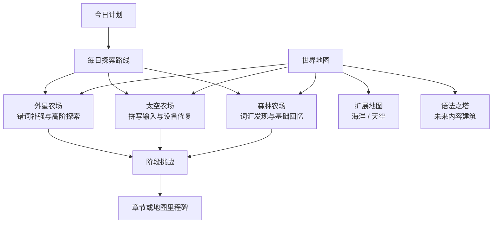

# 11 RPG 探索地图与闯关方案

## 1. 参考项目带来的启发

参考项目“我做了一个英语学习 RGP 闯关系统”展示的重点不是某一种战斗玩法，而是一套容易理解的学习冒险入口：

- `Word Explorer`：把学习者包装成探索者。
- `Forest of Words`：把词汇学习包装成区域探索。
- `Grammar Castle`：把语法内容包装成逐层挑战。
- `Daily Dungeon`：把每日复习包装成短路线。
- `Boss Challenge`：把阶段检查包装成里程碑挑战。
- `Quest + Level Up`：让学习任务产生可见成长。
- 连胜、词汇达人、语法大师和章节完成成就：提供长期目标。

这些概念可以指导森林、太空、外星等探索地图，但不能照搬成另一套章节、经验和学习记录。现有卡片系统继续负责词卡、复习、章节和成长结算；探索地图负责把这些结果表现为道路、建筑、NPC、事件和世界变化。

## 2. 合入后的世界结构



这里有三个层次：

1. 探索地图是长期可返回的空间。
2. 每日路线是从今日到期词、错词和少量新词生成的短任务。
3. Boss 挑战是章节或区域结束时的阶段检查，不是独立地图。

## 3. 参考模块与现有系统的映射

| 参考模块 | 合入后的定义 | 是否作为独立地图 |
| --- | --- | --- |
| `Word Explorer` | 整个像素学习世界的探索身份和主循环 | 否，属于产品包装 |
| `Forest of Words` | 森林农场的词汇发现、听辨和基础回忆路线 | 是，映射森林农场 |
| `Grammar Castle` | 语法/表达内容建筑，按主题逐层挑战 | 暂不作为主地图 |
| `Daily Dungeon` | 从今日计划生成的 3-8 分钟跨地图路线 | 否，属于任务层 |
| `Boss Challenge` | 章节或地图区域的综合学习检查 | 否，属于检查点 |
| `Word Quest` | 一组最多 10 张卡的章节任务 | 否，由卡片系统编排 |
| `Achievements` | XP、等级、连胜、勋章和地图图鉴 | 否，由成长系统结算 |

参考图中的模块名字可以作为灵感，但中文产品不必直接显示“地牢”“Boss”等词。低龄版本可以分别使用“今日探险”“守护挑战”“区域试炼”等更温和的命名。

## 4. 三张主探索地图

### 4.1 森林农场：单词森林

定位：第一次认识词汇、看图听音、完成基础识别和主动回忆。

推荐内容：

- 幼儿园、自然、动物、植物和日常物品词包。
- `english` 域的单词卡。
- 每次 3-5 张新卡，混入到期词和最近错词。

推荐区域：

| 区域 | 学习作用 | 世界反馈 |
| --- | --- | --- |
| 林间入口 | 接受向导任务，查看今日目标 | 路标显示推荐路线 |
| 学习屋 | 看图、听音、查看中文和例句 | 新词进入地图图鉴 |
| 溪流小径 | 根据听音或中文寻找目标 | 架桥、开路或获得水滴 |
| 单词探险屋 | 识别、回忆和短局挑战 | 获得种子和词汇印记 |
| 林地农场 | 播种、照料和收获 | 延迟复习对应作物成熟 |
| 古树检查点 | 完成本区域的混合复习 | 古树点亮，不阻止自由探索 |

森林地图承担完整的首次教学。首次进入不展示段位、语法塔和全部地图系统，先让孩子完成“认识 3 个词 -> 找到目标 -> 获得种子 -> 播种”的闭环。

### 4.2 太空农场：星港修复区

定位：英语拼写、键盘输入、动作词和科技主题词的主动输出。

推荐内容：

- 核心英语、动作、交通、方向和基础科技词包。
- 已完成基础识别、需要加强拼写的卡片。
- 苦力怕打字防守、飞机大战等输入型游戏。

推荐区域：

| 区域 | 学习作用 | 世界反馈 |
| --- | --- | --- |
| 星港大厅 | 领取维修任务，查看待修设备 | 设备故障点可见 |
| 失重温室 | 复习基础词和科技词 | 恢复氧气、作物生长 |
| 维修通道 | 按提示完成逐字拼写 | 修复门、电缆或机器人 |
| 飞行训练站 | 多目标主动输入挑战 | 恢复导航线路 |
| 能源核心 | 补强慢答词和错拼词 | 能源效率提升 |
| 轨道检查点 | 完成本组输入证据 | 点亮轨道信标 |

太空地图的难度来自输出要求，不来自单纯加快速度。移动操作错误、漏目标和拼写错误必须分别记录，避免把操控失败误判为英语不会。

### 4.3 外星农场：遗迹与错词区

定位：到期复习、错词补强、易混淆内容和拓展词探索。

推荐内容：

- Minecraft、拓展英语和最近错词池。
- 已多次出现错误标签的卡片。
- 需要从识别重新过渡到输入的卡片。

推荐区域：

| 区域 | 学习作用 | 世界反馈 |
| --- | --- | --- |
| 传送门 | 显示本次需要稳定的卡片 | 选择推荐路线 |
| 翻译营地 | 查看短解释、联想和例句 | 翻译虫记录弱项 |
| 晶体峡谷 | 辨析易混淆词或表达 | 稳定变异晶体 |
| 异星遗迹 | 完成错词复习短局 | 修复壁画和道路 |
| 变异农场 | 延迟后再次回忆 | 作物品质变得稳定 |
| 遗迹检查点 | 对不稳定卡做综合挑战 | 开启纪念物，不扣长期资源 |

外星地图不能变成“失败惩罚区”。答错只改变推荐题型、复习时间和晶体表现，不摧毁作物、不清空物品，也不禁止返回其他地图。

## 5. 扩展地图的 RPG 方向

海洋和天空继续作为扩展地图，不在第一阶段同时实施：

| 地图 | RPG 探索主题 | 适合能力 | 可接活动 |
| --- | --- | --- | --- |
| 海洋农场 | 潜水、声音定位、珊瑚图鉴 | 听辨、环境词和短句理解 | 听音选择、汉字水泡池 |
| 天空农场 | 云桥、方向、风向和航线 | 拼音、方向词、动作词和竞速 | 代码化拼音赛车、轻量飞行活动 |

扩展地图必须复用同一套路线节点、任务事件、奖励 receipt 和存档结构。差异来自内容、视觉和反馈，不新建第五、第六套学习算法。

## 6. 语法之塔的正确位置

参考项目中的 `Grammar Castle` 很适合做长期内容入口，但当前系统主要是词汇卡，不能把随机单词题伪装成语法学习。

语法之塔应满足以下前置条件：

- 新增独立的 `english-grammar` 或 `english-expression` 内容域。
- 每个主题有稳定 `topicId`、规则说明、正反例、易混淆项和难度等级。
- 结果事件能区分语序、时态、搭配、语境和表达选择错误。
- 网球学英语等表达游戏通过适配器接入，不直接复用单词拼写掌握度。

建议楼层结构：

```text
大厅：查看本次语法主题和例句
  -> 练习层：低风险辨析
  -> 应用层：语境选择或排序
  -> 表达层：网球学英语等短局
  -> 检查层：混合题与错题补强
```

第一阶段只在世界地图预留建筑 ID 和入口位置，不把语法之塔列入 P0/P1 验收范围。

## 7. 每日探索路线

`Daily Dungeon` 应改造成“每日探索路线”，由卡片系统的今日计划生成，不维护自己的题库。

### 7.1 路线组成

```text
今日到期词
  + 最近错词
  + 慢答但独立正确的词
  + 时间允许时的少量新词
  -> 选择最合适的地图和活动
  -> 生成 3-8 分钟路线
```

路线示例：

```text
森林学习屋：认识 2 张新卡
  -> 溪流小径：识别 3 张到期卡
  -> 太空维修站：拼写 2 张不稳定卡
  -> 返回农场：领取一次幂等奖励
```

### 7.2 路线规则

- 每天最多突出一个推荐路线，但其他地图仍可自由进入。
- 优先完成到期复习，不为凑任务数量增加无意义题目。
- 一条路线最多启动两个小游戏，避免频繁加载和上下文切换。
- 中途退出时保存当前节点、剩余卡片和未领取奖励。
- 路线完成只代表今日任务完成，不代表所有卡片已经掌握。
- 没有到期词时可以生成轻量探索或收藏任务，不强迫学习新词。

## 8. 区域挑战与 Boss

Boss 是阶段检查的表现形式，不是用血量代替学习判断。

### 8.1 触发时机

- 完成一个最多 10 张卡的章节组。
- 完成一张地图的主要探索路线。
- 某组错词已经完成基础补强，需要进行延迟检查。
- 玩家主动选择“区域试炼”，而不是系统强制打断探索。

### 8.2 挑战结构

```text
展示本次 6-10 张目标卡
  -> 识别阶段
  -> 输入或表达阶段
  -> 对未稳定卡做一次低难度补强
  -> 宿主判断章节阈值
  -> 地图显示里程碑变化
```

Boss 的生命值可以由“尚未完成的任务数”驱动，但不能出现以下映射：

- 一次游戏命中等于掌握一张卡。
- 连击越高，复习间隔越长。
- 操作失误直接降低词卡掌握度。
- Boss 失败清空章节、作物或长期资源。

未达到章节阈值时，Boss 进入“待补强”状态，地图仍可自由探索，并给出具体的下一步，例如“先复习 2 张容易混淆的卡”。

## 9. 探索路线节点

每张地图使用同一套节点类型：

| 节点类型 | 作用 | 是否一定答题 |
| --- | --- | --- |
| `entry` | 进入、恢复和查看路线 | 否 |
| `npc` | 接受任务、听故事和查看提示 | 否 |
| `learn` | 首次接触卡片 | 是，但不算完全掌握 |
| `encounter` | 在地图中完成识别或回忆 | 是 |
| `activity` | 启动兼容小游戏 | 是 |
| `resource` | 收集、种植、修复或查看世界变化 | 否 |
| `checkpoint` | 阶段总结和补强 | 视学习状态决定 |
| `portal` | 返回世界地图或进入下一推荐区域 | 否 |

地图不能每走几步就弹一道题。建议每两个学习节点之间至少安排一个探索、NPC、资源或世界反馈节点，让移动和发现本身有价值。

## 10. 任务类型

| 类型 | 目的 | 示例 |
| --- | --- | --- |
| 引导任务 | 教会核心循环 | 听 3 个词，找到目标，种下第一颗种子 |
| 地图任务 | 推动区域变化 | 修复星港的 3 台设备 |
| 学习任务 | 产生明确学习证据 | 独立输入 3 张到期卡 |
| 每日路线 | 安排当日负担 | 复习 5 张、新学 2 张，预计 8 分钟 |
| 补强任务 | 处理错误维度 | 完成 2 张错拼词的低难度重试 |
| 区域挑战 | 检查阶段结果 | 完成当前 10 张卡的识别和输入阶段 |
| 收藏任务 | 提供长期探索目标 | 发现 5 种森林种子或 3 块遗迹壁画 |

任务目标必须引用结构化学习证据，不使用“玩 30 分钟”“点击 100 次”作为主要目标。

## 11. 数据结构建议

### 11.1 地图清单

```js
{
  id: "forest-farm",
  title: "森林农场",
  mode: "complete",
  domains: ["english"],
  recommendedPacks: ["starter", "nature", "animals"],
  routeId: "forest-main-route-v1",
  resourceType: "water-drop",
  cropSet: "forest",
  npcSet: ["forest-guide", "honey-helper"],
  activityIds: ["word-memory-map"],
  checkpointPolicy: "chapter-group",
  background: "..."
}
```

### 11.2 路线节点

```js
{
  id: "forest-creek-02",
  mapId: "forest-farm",
  type: "encounter",
  position: { x: 0.42, y: 0.58 },
  taskId: "forest-find-water",
  cardPolicy: {
    domain: "english",
    sources: ["due-review", "new"],
    limit: 3,
    responseMode: "recognition"
  },
  completionPolicy: {
    requiredCompleted: 3,
    masteryRequired: false
  },
  visualStates: ["blocked", "repairing", "open"]
}
```

`position` 使用归一化坐标，方便不同屏幕和地图尺寸复用。节点只声明需要什么能力，不直接 import 具体游戏源码。

### 11.3 探索会话

```js
{
  sessionId: "explore-session-...",
  profileId: "profile-child-1",
  mapId: "forest-farm",
  routeId: "forest-main-route-v1",
  currentNodeId: "forest-creek-02",
  completedNodeIds: ["forest-entry", "forest-learn-01"],
  learningSessionIds: ["card-session-..."],
  worldDiffs: [
    { type: "open-path", targetId: "forest-creek" }
  ],
  unclaimedReceiptIds: [],
  updatedAt: 0
}
```

探索会话保存地图上下文；卡片掌握度继续由学习系统保存。两者通过 `learningSessionIds` 和幂等奖励 receipt 关联，不复制一份学习进度。

## 12. 小游戏在探索地图中的位置

| 探索节点 | 兼容游戏 | 内容域 | 章节作用 |
| --- | --- | --- | --- |
| 森林单词探险屋 | 单词地图、识别游戏 | `english` | 识别和基础回忆 |
| 太空维修通道 | 苦力怕 | `english` | 逐字拼写 |
| 太空飞行训练站 | 飞机大战 | `english` | 主动输入挑战 |
| 天空拼音赛道 | 拼音赛车 | `pinyin` | 拼音和声调辨析 |
| 语法之塔表达层 | 网球学英语 | `english-expression` | 语境和表达选择 |

拼音赛车不能为了丰富英语 RPG 地图而接收英语词卡。它可以在天空农场或拼音章节中使用同一套探索节点协议，但必须声明 `domain: pinyin`。

小游戏结束后必须回到原节点，并保留：

- 地图和路线 ID。
- 当前 NPC 或任务上下文。
- 未完成卡片。
- 已产生但尚未领取的奖励 receipt。
- 下一次推荐节点。

## 13. RPG 成长与学习成长的边界

地图可以显示等级、经验条、资源和成就，但数据来源必须一致：

| 表现 | 数据来源 | 不允许 |
| --- | --- | --- |
| 玩家等级 | 卡片系统的幂等 XP 事件 | 地图自行重复发 XP |
| 地图完成度 | 路线节点和任务完成状态 | 等同于词卡掌握度 |
| 词汇达人 | 延迟独立答对等学习证据 | 只看收集过多少词 |
| 语法大师 | 未来语法域的稳定证据 | 用普通单词题代替 |
| 连续学习 | 有效学习日 | 打开页面即计一天 |
| 地图资源 | 宿主结算后的世界奖励 | 反向修改复习时间 |

详细 XP、等级、段位、连胜和勋章规则继续使用 [AI 学习教练与游戏化成长系统方案](../小游戏优化/02-AI学习教练与成长系统方案.md)，本方案只定义它们在探索地图中的表现位置。

## 14. AI 在探索地图中的用途

AI 适合：

- 根据已确定的今日计划生成一段简短任务背景。
- 让 NPC 解释为什么今天推荐这些卡片。
- 根据错误标签生成一条提示、例句或联想。
- 为已经配置好的章节主题生成候选对话，经校验后使用。

AI 不适合：

- 自行决定孩子已经掌握某个词。
- 绕过内容域把拼音、单词、表达和语法混在一起。
- 每次进入地图临时生成无法恢复的路线。
- 直接发放 XP、解锁地图或修改章节状态。
- 用“上瘾”作为儿童学习产品的设计指标。

路线结构、正确答案、奖励上限和章节阈值必须由确定性配置控制。AI 失败时，地图继续使用本地任务模板和已有内容包。

## 15. 实施顺序

### P0：探索数据契约

- 为森林、太空、外星增加统一 `routeId`、节点类型和活动能力声明。
- 增加探索会话恢复、地图返回和幂等奖励关联。
- 保持三张地图自由进入，只提供推荐路线和软提示。
- 为宿主游戏保存 `returnContext`，结束后返回原节点。

### P1：森林 RPG 垂直切片

- 实现入口、学习屋、溪流小径、探险屋、农场和古树检查点。
- 配置 3 个引导任务、5 个地图任务和 1 个区域挑战。
- 增加一条由今日计划驱动的短探索路线。
- 验证中断恢复、错词补强和结果返回。

### P2：太空地图差异化

- 将输入型游戏接到维修通道和飞行训练站。
- 使用能源、设备和轨道信标表现学习结果。
- 区分移动错误、漏目标和拼写错误。
- 复用森林路线引擎，不复制任务状态机。

### P3：外星错词探索

- 用最近错词和到期复习驱动遗迹路线。
- 增加翻译营地、晶体峡谷和变异农场反馈。
- 实现待补强的区域挑战，不增加失败惩罚。
- 验证跨地图共享学习进度和背包。

### P4：扩展内容

- 在具备独立语法/表达内容包后实现语法之塔。
- 将代码化拼音赛车接入天空拼音路线。
- 根据真实使用数据评估海洋听辨地图。
- 增加跨地图长期探索图鉴，但不扩大第一阶段范围。

## 16. 验收标准

### 地图体验

- [ ] 森林、太空、外星有不同的目标、资源、NPC 和活动，不只是换背景。
- [ ] 每张地图都能自由进入，推荐路线不会变成不可逆硬锁。
- [ ] 小游戏结束后回到原地图、原节点和原任务。
- [ ] 地图移动过程中不会每几步强制弹题。
- [ ] 一条每日路线控制在 3-8 分钟，最多启动两个小游戏。

### 学习质量

- [ ] 路线中的每张卡保留原始 `cardId`、domain 和 session。
- [ ] 识别、输入、拼音、表达和语法证据不会混用。
- [ ] Boss 生命值、地图完成度和游戏分数不会直接改掌握度。
- [ ] 未达标时提供具体补强任务，不清空地图和长期资源。
- [ ] AI 不可用时仍能完成路线、复习和结算。

### 工程质量

- [ ] 三张主地图使用同一种路线节点和探索会话结构。
- [ ] 奖励 receipt 重复提交不会重复发放。
- [ ] 刷新后恢复当前地图、节点、卡片会话和未领奖励。
- [ ] 替换某个小游戏不需要重写地图任务规则。
- [ ] 增加新地图主要通过配置和素材完成，不复制学习算法。

## 17. 与现有方案的关系

- [像素农场学习世界总览](./总览.md)：整体产品入口和实施阶段。
- [核心循环与用户旅程](./01-核心循环与用户旅程.md)：学习、探索、种植和回访循环。
- [多地图与农场成长](./02-多地图与农场成长.md)：地图主题、资源和开放规则。
- [小游戏与建筑设计](./05-小游戏与建筑设计.md)：活动建筑与运行入口。
- [任务、奖励与长期成长](./06-任务奖励与长期成长.md)：任务类型和奖励原则。
- [小游戏综合架构方案](../小游戏优化/01-综合架构方案.md)：小游戏底层、卡片宿主和包装层边界。

