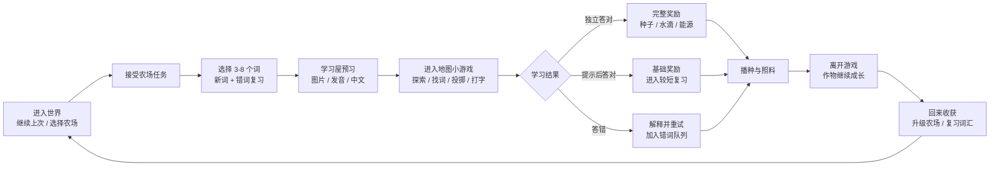

# 像素农场学习世界总览

## 一句话

这是一个拥有森林农场、太空农场和外星农场的像素学习世界。

玩家通过认识、回忆和使用单词，获得种子、能源、晶体、宠物和装饰，让自己的农场不断成长。

> **不是进入题库答题，而是经营农场；学习单词是让农场变好的主要行动。**

---

## 一、整体游戏流程



### 一局实际体验

1. 玩家来到森林农场，向导提出“种一株浆果”的任务。
2. 玩家选择 `tree`、`bird`、`water` 等 3-5 个目标词。
3. 学习屋提供图片、发音和中文，帮助玩家第一次认识词汇。
4. 玩家进入单词探险地图，根据中文或发音找出正确英文目标。
5. 答对获得种子和水滴，答错则看解释、重试，并进入后续复习队列。
6. 玩家回到农场播种，作物在几分钟、几小时或一两天内成长。
7. 下次回来收获作物，并复习上次不稳定的词。

---

## 二、三张主题农场

三张地图不是三个互相割裂的游戏，而是同一个世界里的三个主题区域。

| 地图 | 主要画面 | 学习内容 | 主要玩法 | 地图资源 |
|---|---|---|---|---|
| **森林农场** | 阳光、溪流、动物、植物 | 入门、动物、植物、自然 | 种植、探索、轻量识词 | 水滴、种子 |
| **太空农场** | 星港、温室、机器人、轨道 | 核心英语、科技、交通、动作 | 修设备、打字、能源管理 | 能源、星光作物 |
| **外星农场** | 变异植物、晶体、传送门 | 拓展词、Minecraft 词、错词复习 | 变异、复习、传送门探索 | 晶体、变异品质 |

### 地图开放规则

- 森林农场是推荐的新手起点。
- 太空农场和外星农场可以自由进入。
- 任务只提供推荐路线，不做强制硬锁。
- 三张地图共享角色、宠物、背包、奖励和词卡熟练度。

---

## 三、学习如何变成游戏

学习不只出现在弹窗里，而是直接影响游戏行动。

| 学习行为 | 游戏表现 | 学习证据 |
|---|---|---|
| 看图片、听发音 | 发现种子或 NPC | 第一次接触 |
| 选择中文含义 | 拾取正确种子 | 引导回忆 |
| 根据中文找英文 | 击中目标、打开宝箱 | 主动回忆 |
| 拼写或键盘输入 | 修复飞船、启动机器 | 更强主动回忆 |
| 隔一段时间再次答对 | 收获成熟作物 | 延迟复习 |

### 词卡成长状态

```text
新词 -> 已认识 -> 学习中 -> 稳定 -> 熟练
```

推荐复习间隔：

```text
立即重试 -> 次日 -> 第 3 天 -> 第 7 天 -> 第 14 天 -> 第 30 天
```

答错会缩短复习间隔，但不会销毁玩家已经获得的作物、宠物或装饰。

---

## 四、农场成长

### 作物四阶段

```text
种子 -> 发芽 -> 成长 -> 成熟收获
```

### 成长时间

| 类型 | 时间 | 用途 |
|---|---:|---|
| 快速作物 | 60-120 秒 | 新手教学、短局反馈 |
| 标准作物 | 5-10 分钟 | 一次游戏会话的目标 |
| 长线作物 | 2-8 小时 | 离开后回来收获 |
| 传说作物 | 24-48 小时 | 稀有装饰，不阻塞主线 |

作物不会因为玩家离开、忘记浇水或答错而死亡。学习行为可以提供加速和额外产出，但不会把农场变成压力任务。

### 三类资源

| 资源 | 作用 |
|---|---|
| 星星 | 跨地图兑换装饰、伙伴外观和通用奖励 |
| 地图资源 | 森林水滴、太空能源、外星晶体，用于本地图建设 |
| 词汇印记 | 稳定掌握词汇后获得，用于兑换稀有种子和复习道具 |

---

## 五、已有小游戏在世界中的位置

| 建筑 | 当前项目 | 作用 |
|---|---|---|
| 单词探险屋 | `games/word-memory-map/` | 主线学习、探索、获得种子 |
| 星港训练站 | `games/typing-defense/` | 太空农场的打字和拼写活动 |
| 拼音赛车场 | `games/learning-arcade/` | 拼音识别和短局反应 |
| 汉字水泡池 | `games/hanzi-bubble-runner/`、`games/hanzi/` | 汉字认读和听音 |
| 数学竞技场 | `games/math-pk/` | 数学资源挑战 |
| 宠物图鉴馆 | `games/card-collection/` | 跨地图宠物收藏和成长 |
| 卡牌训练营 | `games/card-arena/` | 伙伴训练和策略活动 |

每个小游戏完成后都应提供三个出口：

1. 回到当前农场。
2. 再玩一局。
3. 复习本局错词。

---

## 六、玩家每次打开游戏看到什么

### 新玩家

```text
森林农场推荐
  -> 选择角色
  -> 向导任务
  -> 学 3 个词
  -> 完成一局
  -> 播下第一颗种子
```

### 老玩家

```text
继续上次
  -> 收获成熟作物
  -> 查看今日到期词
  -> 选择森林 / 太空 / 外星农场
  -> 完成 3-8 个词的小目标
  -> 获得升级或收藏奖励
```

首屏优先展示“继续上次”和当前农场状态，而不是把玩家重新送回一个没有上下文的游戏目录。

---

## 七、实施顺序

| 阶段 | 先完成什么 | 阶段结果 |
|---|---|---|
| **P0** | 世界数据、存档、词卡状态、触摸移动、继续游戏 | 能从入口进入地图并恢复状态 |
| **P1** | 森林农场、4 块地、6 种作物、学习屋、NPC、任务 | 完成第一条完整游戏闭环 |
| **P2** | 太空农场、温室、能源、机器人、打字活动 | 第二张地图有独立主题和玩法 |
| **P3** | 外星农场、变异作物、错词复习、传送门 | 高阶词汇和复习成为长期玩法 |
| **X** | 性能、PWA、移动端测试、内容回归 | 可以稳定发布和持续扩展 |

### 当前第一步

`P0-01：建立森林、太空、外星三张主题农场的数据契约。`

具体执行清单见：

[执行计划/09-推进状态](./执行计划/09-推进状态.md)

---

## 八、完成标准

这套游戏流程最终需要满足：

- 玩家 5 分钟内能理解“为什么学习、为什么种植、为什么回来”。
- 一局游戏控制在 3-8 分钟。
- 每个新词至少有一次主动回忆机会。
- 答错会帮助复习，不会摧毁长期成长。
- 手机可以单手移动、选择、学习和收获。
- 三张地图有不同资源和内容，但不会变成三套难以维护的规则。
- 现有完整内容模式、11 个游戏入口、完整词库和故事地图不退化。

---

## 详细文档

- [核心循环与用户旅程](./01-核心循环与用户旅程.md)
- [多地图与农场成长](./02-多地图与农场成长.md)
- [单词学习机制](./03-单词学习机制.md)
- [词库分层与复习系统](./04-词库分层与复习系统.md)
- [小游戏与建筑设计](./05-小游戏与建筑设计.md)
- [执行计划](./执行计划/README.md)

