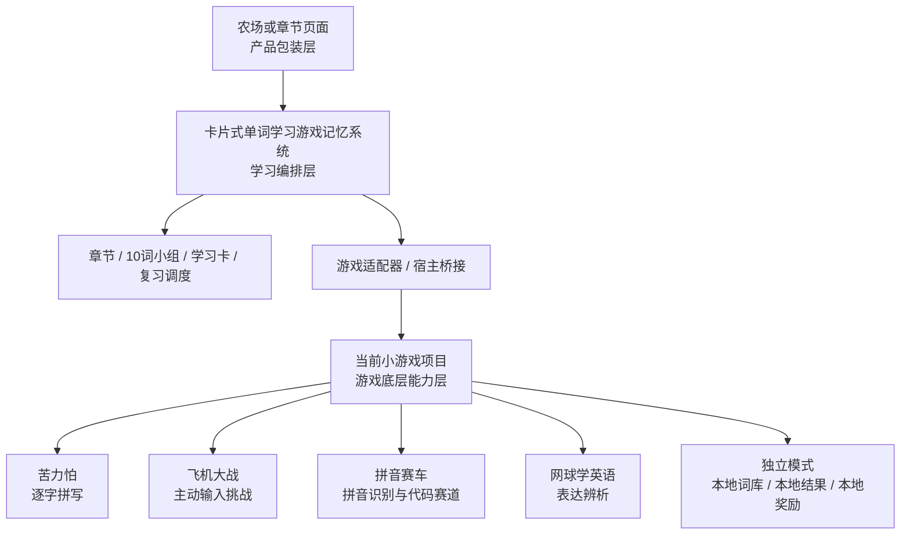

# 小游戏底层与章节学习系统综合方案

## 1. 结论先行

当前小游戏项目和 `G:\StudyCode\卡片式单词学习游戏记忆系统` 不应该合并成一个工程，也不应该让苦力怕、飞机大战、拼音赛车和网球游戏互相直接调用。

推荐采用三层结构：

1. **当前小游戏项目：游戏底层能力层**。负责角色、赛道、战斗、输入、动画、声音和独立可玩的短局。
2. **卡片式单词学习游戏记忆系统：学习编排层**。负责词库、章节、10 词小组、学习阶段、复习算法、Profile、奖励和报告。
3. **农场或章节页面：产品包装层**。负责世界入口、建筑、剧情、章节地图、任务和把一个或多个小游戏包装成完整学习体验。

当前小游戏项目不需要依赖卡片系统才能运行，但应预留一个轻量宿主接口。以后卡片系统可以把这些小游戏作为章节中的一个阶段嵌入，而不需要重写游戏本体。



## 2. 两个项目的边界

### 2.1 当前小游戏项目负责什么

当前项目的核心价值是把每个游戏做得好玩、可运行、可恢复，并提供稳定的学习事件：

- 处理键盘、触控和游戏内输入。
- 处理车辆、敌人、子弹、碰撞、赛道和动画。
- 显示题目、提示、语音和错误反馈。
- 维护本局运行状态和独立模式下的本地回退词库。
- 以标准格式报告每张卡片的学习结果。
- 在没有宿主时仍然可以直接打开并玩。

当前项目不负责：

- 章节解锁和下一章选择。
- FSRS、艾宾浩斯或其他长期记忆算法。
- 家庭 Profile、家长报告和跨设备同步。
- 经验、段位、勋章的最终结算。
- 判断一个章节是否达标。

具体执行分工、任务状态、线程进度和全局验收标准见 [小游戏主控实施计划](../执行计划/00-主控实施总计划.md)。

### 2.2 卡片式单词学习游戏记忆系统负责什么

卡片系统已经具备这些编排能力，应继续作为唯一的学习状态来源：

- 规范词库和稳定 `cardId`。
- `chapters.json` 中的章节、词组和 `gamePolicy`。
- 每组最多 10 张卡的 session。
- `learning -> recognition -> typing -> reinforce -> completed` 阶段状态机。
- 到期复习、FSRS/艾宾浩斯校准和保持率报告。
- Profile 隔离、奖励 receipt、章节解锁和家长复盘。
- 适配器生命周期、宿主 iframe 和游戏结果归一化。

AI 学习教练、每日计划、XP、等级、连胜和勋章属于卡片系统的学习与成长能力，详细规则见 [AI 学习教练与成长系统方案](./02-AI学习教练与成长系统方案.md)。当前小游戏只提供单卡结果、错误标签和响应时间等输入信号。

它不应该复制一份苦力怕或飞机大战的战斗逻辑，也不应该通过修改游戏内部变量来完成章节结算。

### 2.3 农场或章节包装层负责什么

包装层可以是当前项目未来的像素农场，也可以是卡片系统自己的章节首页。它负责把学习结果变成用户看得懂的世界变化：

- “完成识别阶段”后打开一座建筑。
- “完成输入阶段”后获得种子或道具。
- “复习到期词”后让作物成长或解锁下一段地图。
- 显示今天为什么推荐这些词，以及下一次什么时候复习。

包装层只读取宿主层已经结算的结果，不应该直接从游戏分数推断掌握度。

森林、太空、外星等探索地图如何承载每日路线、区域挑战、语法之塔和小游戏返回上下文，见 [RPG 探索地图与闯关方案](../像素农场学习世界/11-RPG探索地图与闯关方案.md)。这些地图属于包装层，不改变小游戏与卡片宿主之间的协议。

## 3. 四个小游戏是否需要互相配合

### 3.1 不需要直接配合

四个游戏不应形成如下强耦合流程：

```text
苦力怕结束后直接启动飞机大战
 -> 飞机大战把内部状态传给拼音赛车
 -> 拼音赛车再决定章节是否完成
```

这种方式会导致：

- 任意一个游戏改内部状态，其他游戏都要跟着改。
- 单独打开一个游戏时无法运行。
- 游戏分数和学习掌握度互相污染。
- 未来替换某个小游戏时，章节流程也被迫重写。

### 3.2 需要在能力层配合

四个游戏只需要遵守同一套底层契约：

| 共享内容 | 是否需要统一 | 说明 |
| --- | --- | --- |
| 卡片 ID | 必须 | 宿主用它对应词卡进度 |
| 题目输入字段 | 必须 | 游戏可忽略自己不使用的字段 |
| 单卡结果 | 必须 | 宿主据此写入复习事件 |
| 游戏分数 | 不必 | 只用于游戏内反馈 |
| 角色、装备、地图 | 不必 | 保持游戏个性 |
| 章节顺序 | 不由游戏决定 | 由卡片系统路由 |
| 错题复习 | 需要支持入口 | 具体呈现由游戏自己决定 |
| 游戏之间直接传状态 | 不允许 | 通过宿主的卡片 session 间接衔接 |

换句话说，游戏之间共享的是“插座形状”，不是内部电路。

## 4. 四个游戏在章节中的角色

### 4.1 英语单词章节

卡片系统当前已经在 `data/word-quest/chapters.json` 中使用 `gamePolicy`：

| 难度 | 识别阶段 | 输入阶段 | 目的 |
| --- | --- | --- | --- |
| 1-2 | 单词赛车或轻量识别 | 苦力怕 | 先建立词形和词义，再练完整拼写 |
| 3 | 像素单词冒险 | 苦力怕 | 通过语境识别，再完成输入 |
| 4-5 | 像素单词冒险 | 飞机大战 | 对熟悉词进行多目标主动输入挑战 |

当前项目中的苦力怕和飞机大战适合做英语输入阶段，但它们不需要知道自己处于第几章。宿主只给它当前小组的卡片和模式。

### 4.2 拼音章节

拼音赛车使用的是汉字、拼音、声调数据，与卡片系统当前的英语 `vocab-catalog.json` 不是同一个域。不要为了“所有游戏都参与章节”而把拼音卡硬塞进英语章节。

建议单独声明：

```text
domain: pinyin
contentType: hanzi-pinyin
gameId: pinyin-racer
```

以后如果卡片系统增加汉字/拼音章节，拼音赛车可以作为识别阶段或声调辨析阶段接入；在当前英语章节中，它保持独立运行。

### 4.3 英语表达章节

网球学英语不是逐字拼写游戏，而是“释义/例句 -> 表达选择 -> 回球”的表达辨析游戏。它适合独立的 `english-expression` 内容域：

- 适合绘本、教材、文章和社群读本中的短语。
- 不建议直接使用当前单词章节的随机单词卡。
- 可以先作为章节中的可选挑战，验证表达复习价值。
- 未来可以设计“阅读章节 -> 网球表达复习 -> 例句输出”的专门路线。

## 5. 推荐的章节流程

卡片系统的一个章节组仍然保持最多 10 张卡。游戏只是其中一个阶段，不是章节本身。

```text
进入今日计划
  -> 选择到期词 + 少量新词
  -> 学习卡阶段：看图、释义、发音、例句
  -> 识别游戏阶段：单词赛车 / 像素单词冒险
  -> 判断是否达到 recognitionThreshold
  -> 输入游戏阶段：苦力怕 / 飞机大战
  -> 判断是否达到 typingThreshold
  -> 未达标：只对未稳定卡进入 reinforce
  -> 写入奖励、章节进度和下一次复习时间
  -> 返回章节或农场，显示世界变化
```

### 5.1 游戏阶段不一定全部运行

每个章节不需要让孩子连续玩四个游戏。建议一次最多安排：

- 一个学习卡阶段。
- 一个识别阶段。
- 一个输入阶段。
- 一个短复习或补强阶段。

拼音赛车、网球学英语属于其他内容域或可选能力，不应为了“内容丰富”强行塞入每一章。

### 5.2 同一组卡贯穿阶段

章节系统应把同一组卡交给不同游戏：

```text
cards = [A, B, C, D, E, F, G, H, I, J]

学习卡：介绍 A-J
识别游戏：仍然使用 A-J
输入游戏：仍然使用 A-J
补强阶段：只使用未达标的 B、F、H
```

游戏不能自行重新随机整套词库，否则学习卡阶段和游戏阶段就不再是同一轮学习。

### 5.3 宿主统一结算

游戏只输出：

```js
{
  cardId: "vocab-block",
  correct: true,
  independent: true,
  hintUsed: false,
  responseMode: "typing",
  responseMs: 1840,
  errorTags: [],
  sourceGame: "creeper-typing"
}
```

宿主负责把它转换成卡片系统自己的：

```text
ReviewEvent
 -> CardProgress
 -> 阶段阈值
 -> RewardReceipt
 -> ChapterState
```

游戏的 `score`、`combo`、`coins` 可以保留，但不能直接写入 `CardProgress` 或章节解锁。

## 6. 当前项目的独立模式

当前小游戏项目在没有卡片系统时应该这样运行：

```text
当前项目首页
  -> 选择小游戏
  -> 使用本地词库或内置回退卡片
  -> 运行完整游戏
  -> 记录本地本局统计和轻量进度
  -> 显示再玩 / 复习 / 返回入口
```

独立模式允许有自己的词库选择、难度和游戏奖励，但这些数据只属于当前项目。它不需要：

- 读取卡片系统的 `chapters.json`。
- 引入卡片系统的 FSRS 实现。
- 创建 Profile、章节 receipt 或家长报告。
- 为了宿主模式改变默认启动体验。

宿主模式只在 URL 或初始化消息明确开启时生效，例如：

```text
?host=1&hostGame=creeper-typing&autostart=1
```

没有 `host=1` 时，游戏继续使用当前项目的独立入口和现有回退逻辑。

## 7. 需要预留的游戏宿主接口

### 7.1 游戏能力清单

每个游戏建议预留一个 `game-manifest.json`，让外部系统不必猜 URL 和能力：

```json
{
  "protocolVersion": 1,
  "gameId": "creeper-typing",
  "title": "消灭苦力怕",
  "sourceGame": "petbank-typing-defense",
  "domains": ["english"],
  "contentTypes": ["word"],
  "modes": ["typing", "listening-typing", "meaning-typing"],
  "supportsHost": true,
  "supportsSnapshot": true,
  "minCards": 1,
  "maxCards": 10,
  "entry": "index.html?host=1&hostGame=creeper-typing"
}
```

拼音赛车的清单应声明 `domains: ["pinyin"]`，网球学英语应声明 `contentTypes: ["expression"]`。能力清单比游戏名称更重要，章节系统应该根据能力选择游戏。

### 7.2 宿主生命周期

当前卡片系统已有 `createGameLifecycle()` 和 `createFullGameAdapter()`，当前项目预留的接口应与它们兼容：

```js
const game = createGame({
  cards,
  sessionId,
  mode,
  seed,
  now,
  onCardResult,
  onComplete,
  onError
});

game.mount(container);
game.stop();
game.getSnapshot?.();
```

生命周期要求：

- `mount()` 只初始化当前 session，不自行读取宿主的整套词库。
- `stop()` 必须停止计时器、动画、声音和事件监听。
- `onCardResult()` 每张卡最多提交一次，重复提交由宿主拒绝。
- `onComplete()` 只报告本局结果，不结算章节奖励。
- `onError()` 报告持久化或资源错误，不能静默当作答错。
- `getSnapshot()` 用于刷新恢复和宿主离开前保存，不要求暴露全部内部对象。

### 7.3 浏览器宿主桥接

卡片系统目前使用 `word-quest-host` / `word-quest-game-bridge`。为了让当前项目未来可被其他学习项目调用，建议把协议抽象为通用的 `learning-game-host` / `learning-game-bridge`，并保留 Word Quest 兼容别名。

握手流程：

```text
游戏 iframe -> host: ready
宿主 -> 游戏 iframe: init(cards, session, mode, seed)
游戏 -> 宿主: card-result
游戏 -> 宿主: complete
宿主 -> 游戏: stop
```

初始化示例：

```js
{
  source: "learning-game-host",
  kind: "init",
  payload: {
    protocolVersion: 1,
    sessionId: "session:kid_a:group-001:20260727",
    gameId: "creeper-typing",
    mode: "meaning-typing",
    seed: "group-001-v1",
    cards: [
      {
        id: "vocab-block",
        word: "block",
        translation: "方块",
        image: "assets/block.webp",
        audio: "assets/block.mp3",
        example: "Build a block wall.",
        distractors: []
      }
    ],
    autostart: true
  }
}
```

游戏结果示例：

```js
{
  source: "learning-game-bridge",
  kind: "card-result",
  payload: {
    protocolVersion: 1,
    sessionId: "session:kid_a:group-001:20260727",
    gameId: "creeper-typing",
    cardId: "vocab-block",
    correct: true,
    grade: "good",
    independent: true,
    hintUsed: false,
    responseMode: "meaning-typing",
    responseMs: 1840,
    errorTags: [],
    operationErrors: 0
  }
}
```

生产环境不能一直使用 `*` 作为 `targetOrigin`。宿主应传入允许的 origin，游戏也应校验消息来源、`sessionId`、`gameId` 和 `cardId`。

### 7.4 宿主模式的数据原则

进入宿主模式后：

- 游戏可以保留临时快照，但不应把外部卡片写入自己的长期词库。
- 游戏可以显示本地分数，但不应直接写外部系统的经验、积分或章节状态。
- 游戏收到的未知卡片字段应忽略，不能因为新增字段导致崩溃。
- 游戏提交结果时必须带上宿主传入的 `sessionId` 和原始 `cardId`。
- 宿主中断或刷新后，游戏应允许重新初始化同一个 session。
- 没有宿主初始化成功时，回退到独立模式或显示可重试状态，不能使用半套外部数据。

## 8. 卡片字段的兼容策略

当前卡片系统的基础英语卡片已经包含 `id`、`word`、`translation`、`image`、`audio`、`example`、`exampleZh` 和 `distractors`。当前项目的游戏适配层先支持这些最小字段：

```js
{
  id,
  word,
  translation,
  image,
  audio,
  example,
  exampleZh,
  distractors
}
```

扩展字段可以后续增加：

```js
{
  domain: "english|pinyin|english-expression",
  contentType: "word|hanzi-pinyin|expression",
  difficulty: 1,
  sourcePack: "minecraft-core",
  phonetic: "",
  pinyinDisplay: "",
  pinyinKey: "",
  tone: null,
  definitionEn: "",
  confusionSet: []
}
```

游戏必须按 `contentType` 选择显示和输入方式，不要用“字段是否存在”猜题型。例如拼音卡的 `pinyinDisplay` 不能被英语打字游戏误当成英文答案。

## 9. 当前项目与卡片系统的接入方式

### 9.1 推荐方式：卡片系统作为外部宿主

卡片系统启动章节阶段时：

1. 读取自己的 `chapters.json` 和当前 Profile。
2. 根据 `gamePolicy` 选择 `recognitionGame` 或 `typingGame`。
3. 通过适配器将当前小组卡片转换成宿主 payload。
4. 以 iframe 或同页 adapter 启动当前项目的某个游戏。
5. 接收每张卡的结果并调用自己的 `word-quest-progress`。
6. 章节系统判断阈值、写入 reward receipt 和解锁状态。
7. 游戏停止并返回章节页面。

当前卡片系统已有的 `js/games/full-game-adapter.js` 可以作为第一版实现基础；当前项目只需要补齐兼容的 host 入口和结果消息。

### 9.2 不推荐方式：当前项目直接依赖卡片系统源码

不建议在当前项目中直接 import：

- `word-quest-session.js`。
- `word-quest-progress.js`。
- `word-quest-rewards.js`。
- `chapters.json`。
- 卡片系统的 Profile storage key。

这样会让当前小游戏项目失去独立运行能力，也会造成两个项目的版本和路径耦合。

### 9.3 资源发布方式

当前项目和卡片系统不应通过开发机绝对路径互相读取资源。建议：

- 当前项目保留完整源代码和独立资源。
- 卡片系统通过复制/构建清单发布一份游戏制品。
- 制品包含 `index.html`、脚本、manifest、所需图片和音频。
- 章节系统只引用制品入口，不引用源项目绝对路径。
- 发布时记录 `gameVersion` 和资源 manifest，便于回滚。

## 10. 章节式包装的推荐形态

### 10.1 外层章节壳

卡片系统或农场项目在游戏 iframe 外提供：

- 章节名称和当前主题。
- `第 3/10 张卡` 和阶段标签。
- 退出、暂停、返回章节按钮。
- 当前小组的完成度和未稳定卡数量。
- 游戏结束后的学习报告。

游戏内部只展示与自己动作有关的 HUD，不再重复实现章节解锁、今日计划和全局 Profile。

### 10.2 不同游戏的包装文案

同一组卡可以被不同包装解释：

| 阶段 | 游戏 | 外层章节语义 |
| --- | --- | --- |
| 识别 | 单词赛车 | 找到正确词，打开下一段路 |
| 拼写 | 苦力怕 | 输入正确单词，守住基地 |
| 挑战 | 飞机大战 | 锁定目标并完成主动输入 |
| 拼音 | 拼音赛车 | 仅在汉字/拼音章节中作为声调或拼音路段 |
| 表达 | 网球学英语 | 在语境中选出正确表达 |

外层可以给它们同一个章节主题，但不能要求游戏共享角色、敌人或内部状态。

### 10.3 AI 教练与成长反馈的外层位置

章节或农场包装层可以展示“今日复习 8 张、学习 3 张、预计 18 分钟”，也可以把 XP、等级、勋章包装成建筑、称号或装饰。它读取卡片系统已经结算的计划和成长快照，不从游戏分数自行推断学习效果。

游戏内部只需要显示即时反馈，例如“连对里程碑”“本题需要再练一次”或“还有 2 张卡待补强”。AI 解释、每日计划和长期奖励不应分别在四个游戏里复制。

具体的 XP 规则、段位、勋章、AI 缓存与失败回退见 [AI 学习教练与成长系统方案](./02-AI学习教练与成长系统方案.md)。

## 11. 实施顺序

### P0：当前项目只做接口预留

- 为苦力怕、飞机大战、拼音赛车建立 `game-manifest.json`。
- 增加统一的卡片标准化函数，支持 `id/word/translation/image/audio/example`。
- 增加 host 模式开关，不影响独立模式。
- 增加 `ready/init/card-result/complete/stop` 消息协议。
- 结果消息包含 `protocolVersion`、`sessionId`、`gameId` 和 `cardId`。
- 增加宿主模式的最小测试，不在当前项目引入章节、Profile 或 FSRS。

### P1：卡片系统接入现有游戏

- 在卡片系统中扩展 `full-game-adapter` 的 URL 和 `sourceGame` 映射。
- 让苦力怕和飞机大战先接入英语章节输入阶段。
- 让识别游戏继续由卡片系统当前的 `word-racer` / `pixel-word-adventure` 负责。
- 明确当前项目的 `word-cannon` 拼音赛车不能直接冒充英语 `word-racer`。
- 通过结果回调接入现有 `word-quest-progress`、`word-quest-session` 和 `word-quest-rewards`。
- 在卡片系统中实现每日计划、成长事件和幂等奖励 receipt；当前小游戏只接收宿主初始化并上报结果。

### P2：章节式游戏包装

- 让 `gamePolicy` 支持 `recognitionGame`、`typingGame`、可选 `reinforceGame`。
- 将同一组卡贯穿学习卡、识别、输入和补强阶段。
- 增加拼音章节和英语表达章节的 `domain/contentType` 路由。
- 在章节页显示“为什么进入这个游戏”和“完成后会推进什么”。
- 增加游戏替换和版本回滚能力。

### P3：高级能力

- AI 根据游戏结果生成解释和例句，但不直接改写掌握度。
- AI 教练先做解释、例句、联想和弱项摘要，再根据真实保持率逐步做个体化推荐。
- 增加 +2 XP、连对里程碑、7 日 streak、等级和勋章的可追溯事件；这些数据不反向覆盖学习掌握度。
- 根据章节主题生成赛道主题、战斗任务或网球表达包。
- 统计不同游戏对保持率的贡献，但不把游戏时长作为学习效果。
- 支持同一游戏被多个学习项目宿主调用。

## 12. 验收标准

### 当前小游戏项目

- [ ] 不连接卡片系统时，四个游戏仍能直接启动和完成一局。
- [ ] 开启 host 模式后，游戏使用宿主传入的卡片，不随机替换成自己的词库。
- [ ] 每张卡最多发送一次 `card-result`。
- [ ] `stop()` 能停止计时器、动画、语音和事件监听。
- [ ] 刷新或重新初始化可以恢复同一个 `sessionId`。
- [ ] 游戏分数和本地奖励不会伪装成外部掌握度。

### 卡片式单词学习游戏记忆系统

- [ ] 章节系统可以把一组最多 10 张卡传给任意兼容游戏。
- [ ] 宿主只根据标准结果更新进度和奖励。
- [ ] 游戏不会直接解锁章节或写入 Profile 进度。
- [ ] 识别、输入、拼音和表达域不会混用错误的卡片字段。
- [ ] 游戏替换后，章节 session、复习事件和奖励 receipt 不丢失。
- [ ] iframe 通信校验 `origin`、`sessionId`、`gameId` 和 `cardId`。

### 产品层

- [ ] 玩家能理解当前是“学习卡、识别、输入还是复习”阶段。
- [ ] 完成小游戏后能回到原章节或农场，而不是丢失上下文。
- [ ] 游戏成绩与学习保持率分开显示。
- [ ] 一个章节不强制连续玩四个小游戏。
- [ ] 任何小游戏都可以被替换而不重写章节规则。
