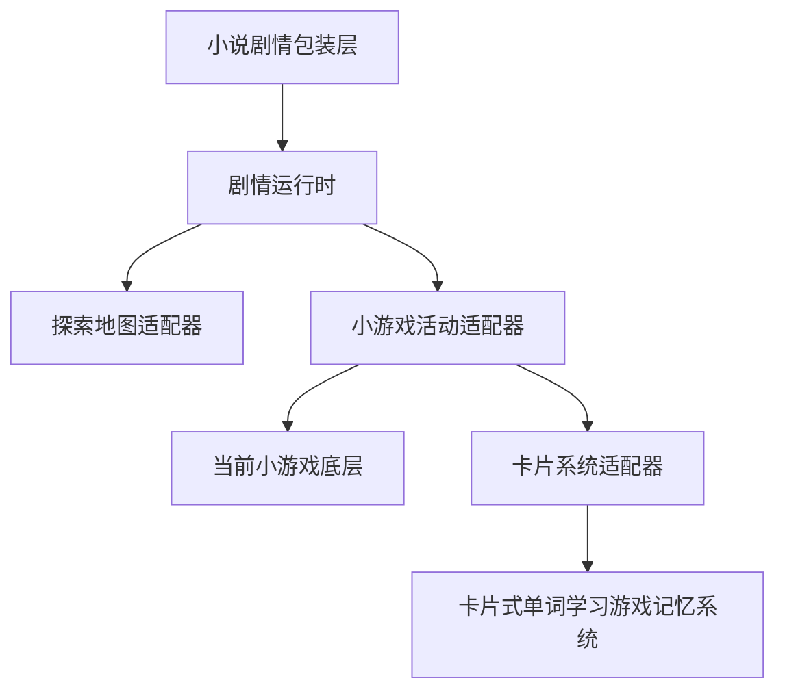

# 小说改编游戏当前能力与参考分析

## 1. 文档定位

本文把参考项目 `docs/参考项目/simpread-把任何小说变成可玩的网页游戏.md` 映射到当前小游戏项目，回答三个问题：

1. 这套“小说改编成网页游戏”的方法是否能在本项目落地。
2. 当前项目已经具备哪些可复用能力，哪些能力不能直接复用。
3. 后续应该先改什么、暂时不改什么，以及如何避免小说内容反过来破坏现有学习小游戏。

当前状态：**方案已落地，运行时代码尚未开始改造**。

## 2. 结论先行

可以落地，但不能把“任意小说一键生成高质量完整游戏”当作第一阶段目标。适合当前项目的落地方式是：

> **内容包驱动的小说改编生产流程 + 通用剧情游戏运行时 + 可选的探索地图和小游戏适配器。**

第一阶段采用“模板化、半自动、人工确认”的方式，先完成一篇短篇公版小说或一个章节的垂直切片。AI 负责提取候选设定、生成候选分支和文案草稿；确定的剧情、答案、奖励、资源和结局由内容包锁定，运行时不依赖 AI 临时生成。

当前小游戏项目继续作为底层能力层：

- 负责输入、动画、战斗、赛道、单局游戏、独立运行和学习事件。
- 不负责小说版权判断、剧情一致性、长期成长、FSRS、Profile 或章节解锁。
- 不要求苦力怕、飞机大战、拼音赛车和网球学英语互相直接调用。

小说剧情层可以在上面包装一层；卡片式单词学习游戏记忆系统仍是可选的学习编排层，不是小说运行时的必选依赖。

## 3. 参考文档的七步流程映射

| 参考流程 | 本项目落地物 | 第一阶段是否实现 | 约束 |
| --- | --- | --- | --- |
| 需求 | `01-产品简报` | 是，人工确认 | 平台、受众、内容分级、核心幻想冻结后不得静默改写 |
| 原著分析 | `02-原著设定集` | 是，半自动 + 人工校验 | 必须区分原文事实、推断和原创扩展 |
| 改编方向 | `03-改编方向` | 是 | 至少提供 3 个差异明显的方向，再选择 1 个 |
| 游戏设计 | `04-游戏设计` | 是 | 锁定场景、节点、选择、活动、结局和保存规则 |
| 美术方向 | `05-美术方向` | 是，轻量版 | 先使用 CSS、现有素材或占位图，不把生图当作运行时依赖 |
| 构建 | `06-构建任务` | 是 | 交给明确范围的编码任务，不直接改四个学习游戏内部逻辑 |
| 验证 | `07-验收报告` | 是 | 必须区分静态、Node、真实浏览器和真实宿主证据 |

参考项目中的英文文件名不作为本项目命名规范。当前项目统一使用中文编号文件名，且不创建 `README` 文件名。

## 4. 当前项目可复用能力

| 能力 | 当前位置 | 可以怎么复用 | 当前限制 |
| --- | --- | --- | --- |
| 探索地图和节点 | `games/explore-map/forest-route.js`、`exploration-session.js` | 作为小说世界地图、场景入口和活动返回的参考实现 | 当前实现写死森林地图和学习活动，不是通用剧情运行时 |
| 地图会话恢复 | `games/explore-map/exploration-session.js` | 复用 `sessionId`、当前节点、返回上下文、刷新恢复思路 | 现有字段面向探索地图，还不能表达对话、分支和结局 |
| 小游戏宿主协议 | `host/mini-game-host-protocol.md`、`bridge.js` | 通过 `ready/init/card-result/complete/stop/error` 启动活动并接收结果 | v1 主要描述卡片活动，不描述剧情节点状态机 |
| 现有小游戏 | `games/typing-defense/`、`games/learning-arcade/` 等 | 作为剧情节点中的可选战斗、输入、识别或表达活动 | 游戏内部仍是专用实现，不能假设任何小说世界状态 |
| 内容和 manifest | `data/manifest.json`、`data/maps-manifest.json`、各游戏 manifest | 参考稳定 ID、版本、能力和资源声明 | 还没有小说内容包的 schema 和验证器 |
| 浏览器/契约测试 | `tests/` | 复用 Node 契约测试、真实浏览器几何和交互验收习惯 | 尚无剧情节点、可达性、分支覆盖和素材断链检查 |

## 5. 当前缺口

### 5.1 内容缺口

- 没有通用的小说项目工作区和内容包目录。
- 没有原著事实、推断、原创内容、版权来源的分层记录。
- 没有角色、地点、道具、任务、对话、选择、分支和结局的稳定 ID。
- 没有把“章节文本”转换成“可玩的场景和行动”的固定模板。

### 5.2 运行时缺口

- 没有通用剧情节点运行时。
- 没有可配置的对话、选择、条件、变量、任务和结局状态机。
- 没有通用保存/恢复、重新开始、坏存档回退和内容包版本校验。
- 没有活动节点适配层，不能只用 `gameId + payload + returnContext` 调用现有小游戏。

### 5.3 工程和验收缺口

- 没有内容包 schema、静态校验器、资源 manifest 和构建产物目录。
- 没有不可达节点、循环死路、未定义角色/资产、结局不可达等 QA 规则。
- 没有统一的“静态证据、Node 证据、真实浏览器证据、真实宿主证据”分级记录。
- 没有儿童内容分级、版权来源、AI 生成记录和人工审查清单。

## 6. 三层边界

### 6.1 小说剧情层负责

- 场景、对话、角色关系、任务、分支、结局和叙事节奏。
- 小说世界的地图表现、节点可见性和剧情变量。
- 选择带来的剧情后果，以及活动完成后回到哪里。
- 内容来源、版权、分级和人工审查记录。

### 6.2 当前小游戏项目负责

- 游戏内输入、动画、碰撞、提示、错误反馈和单局结果。
- 独立模式和宿主模式的稳定入口。
- 以 v1 协议报告活动结果，不自行决定剧情结局或长期成长。

### 6.3 卡片系统负责

只有小说章节被包装为英语、拼音或表达学习内容时，才由卡片系统接入：

- 词卡、内容域、复习调度、FSRS、Profile、XP、奖励和章节达标。
- 通过 adapter/host 传入卡片和 session，不读取小说运行时内部变量。
- 游戏结果只能作为学习证据输入，不能由分数直接改变掌握度。

## 7. 推荐 MVP

选择一篇短篇公版小说，或一章权利明确的原创内容，完成以下垂直切片：

- 5-8 个场景节点。
- 3-5 个角色。
- 1 张探索地图或场景关系图。
- 2-3 个有明确后果的选择。
- 1 个战斗、输入或解谜小游戏活动。
- 2-3 个可从起点实际抵达的结局。
- 保存、刷新恢复、重新开始和返回入口。
- 桌面浏览器和 `360x800` 移动视口验收。
- 内容来源、版权、内容分级、AI 草稿和人工确认记录。

不把四个学习小游戏全部塞进首个小说章节，也不在第一阶段建设“任意小说一键生产成品”的通用 AI 系统。

## 8. 不能接受的实现方式

- 运行时每次进入场景都让 AI 临时决定正确答案、奖励或结局。
- 让小说页面直接写卡片系统的 Profile、FSRS、奖励或章节解锁 storage key。
- 为小说复制一份学习算法或复制四个游戏的战斗逻辑。
- 用游戏分数、Boss 血量或点击次数直接推断词卡掌握度。
- 把未经确认的原著推断当成事实展示。
- 没有版权来源和内容分级就批量导入受保护小说。

## 9. 采用标准

本方案进入实施的门槛是：

1. 内容包能在没有 AI、没有卡片系统时独立启动和恢复。
2. 每个剧情节点、活动和结局都有稳定 ID 和静态可验证引用。
3. 小游戏调用只依赖现有 host v1 或明确的 adapter，不修改游戏内部掌握度逻辑。
4. 任何“通过”都记录可复查证据，不把 Node/fixture/HTTP 200 说成真实浏览器或真实宿主通过。

