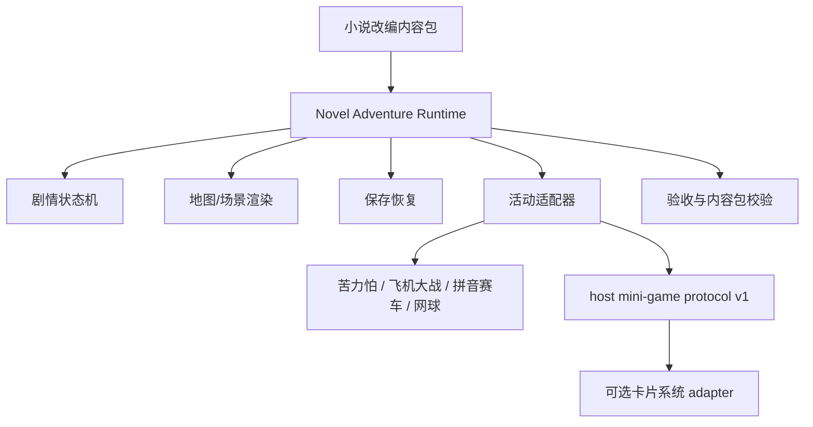

# 小说改编综合落地方案

## 1. 目标

在当前小游戏项目上增加一层可配置的小说剧情体验，使一篇短篇小说或一个章节可以被改编成可探索、可选择、可保存、可重玩的网页游戏，同时保留现有小游戏的独立性和卡片系统的边界。

产品目标不是复述小说，而是把原著中的“行动、关系、地点、风险和选择”转换成玩家可操作的反馈循环：

```text
进入场景 -> 观察/对话 -> 做出选择 -> 触发后果
       -> 探索/小游戏活动 -> 获得剧情证据或资源
       -> 解锁下一节点 -> 走向结局
```

## 2. 产品定位

### 2.1 第一阶段定位

- 产品形态：移动端优先的单章节网页游戏。
- 内容形态：公版小说短篇、原创内容或已取得授权的章节。
- 游戏形态：探索地图 + 对话选择 + 一次短活动 + 多结局。
- 运行方式：独立运行优先，宿主接入预留。
- 生成方式：AI 辅助分析和起草，人工确认后固化内容包。

### 2.2 不承诺的能力

- 不承诺任意长度、任意类型小说都能一键生成高质量成品。
- 不承诺 AI 自动保证原著事实、人物动机和版权安全。
- 不承诺每部小说都适合战斗、学习或 RPG；改编方向必须由内容选择决定。
- 不承诺第一阶段支持在线多人、实时生成世界或跨设备同步。

## 3. 总体架构



推荐未来运行时代码边界：

```text
games/novel-adventure/
  index.html
  runtime.js
  story-state.js
  story-renderer.js
  activity-adapter.js
  storage.js
  styles.css
tests/test-novel-adventure.mjs
tests/test-novel-content-contract.mjs
```

这些路径是后续实施计划中的目标文件，本轮不创建代码。

## 4. 七步生产流水线

每个小说项目独立维护一套内容工作区：

```text
content/novel-adaptations/<project-id>/
  01-产品简报.md
  02-原著设定集.md
  03-改编方向.md
  04-游戏设计.md
  05-美术方向.md
  06-构建任务.md
  07-验收报告.md
  content/
    project-manifest.json
    characters.json
    scenes.json
    activities.json
    endings.json
    assets-manifest.json
    source-record.json
  build/
    app/
```

### 4.1 产品简报

必须锁定：

- `projectId`、标题、目标平台和运行模式。
- 目标年龄、内容分级、禁用内容和阅读前置说明。
- 改编范围：整部小说、章节、片段或原创续写。
- 核心幻想：玩家要做什么、承担什么风险、获得什么反馈。
- 游戏类型、参考作品、视觉方向和预期时长。
- 版权来源、授权状态和可使用的原文范围。

### 4.2 原著设定集

所有提取结果要分为三类：

| 类型 | 含义 | 运行时规则 |
| --- | --- | --- |
| `fact` | 原文明确出现或可定位的事实 | 可以作为确定内容 |
| `inference` | 根据原文推断的关系、动机或时间线 | 必须人工确认后使用 |
| `original` | 为可玩性新增的场景、选择或支线 | 必须标注为改编原创 |

设定集至少包含角色、地点、道具、行动规则、关系、时间线、名场面和可交互元素。

### 4.3 改编方向

至少生成三个真正不同的方向，例如：

1. 探索叙事：地图移动、对话、线索收集和多结局。
2. 资源决策：时间、声望、风险或关系资源管理。
3. 指令冒险：回合行动、事件选择和一次战斗/解谜。

筛选时按“原著适配度、可玩性、实现成本、内容风险、重玩价值”打分，不按视觉炫技选方案。

### 4.4 游戏设计

游戏设计要给每个节点一个可验证的状态转移：

```text
当前节点 + 玩家动作 + 条件
  -> 新节点 + 变量变化 + 任务变化 + 可选活动
```

一个节点至少说明：入口条件、显示内容、可选动作、动作结果、离开条件、失败/重试路径和保存点。

### 4.5 美术方向

先定义可执行的视觉约束：色板、字号、对比度、场景层级、角色标识、按钮状态、错误反馈和移动端安全区。美术生成记录只服务于内容包，不把远程图片或 AI 服务作为游戏启动依赖。

### 4.6 构建任务

构建任务必须写明：代码范围、禁止修改范围、数据入口、状态机、测试命令、浏览器验收路径和未完成项。它应当可以交给一个独立执行线程，而不是一句“把小说做成游戏”。

### 4.7 验收报告

分别记录：

- 内容包 schema 和引用校验。
- Node 运行时测试。
- 真实浏览器启动、场景切换、选择、活动返回、刷新恢复和移动端布局。
- 真实宿主接线，如有接线；没有则明确为 fixture 或独立模式证据。
- 结局覆盖、资源断链、不可达节点、死循环和存档损坏处理。

## 5. 剧情运行时模型

### 5.1 节点类型

第一版只支持以下节点，避免一开始做成不可控的通用脚本语言：

| `nodeType` | 用途 | 必需字段 |
| --- | --- | --- |
| `scene` | 场景叙事和环境观察 | `nodeId/title/body/actions` |
| `dialogue` | 角色对话 | `nodeId/speakerId/lines/actions` |
| `choice` | 有后果的选择 | `nodeId/options` |
| `explore` | 场景内线索或地点探索 | `nodeId/locations/actions` |
| `activity` | 调用一个小游戏或解谜活动 | `nodeId/activityId/returnPolicy` |
| `checkpoint` | 记录任务、变量或阶段 | `nodeId/effects/nextNodeId` |
| `ending` | 结局展示和重玩出口 | `nodeId/endingId/summary` |

不在第一版支持任意 JavaScript 表达式。条件只允许使用受限比较：`equals`、`notEquals`、`in`、`gte`、`hasFlag`。

### 5.2 运行时状态

```json
{
  "schemaVersion": 1,
  "sessionId": "novel-session-001",
  "projectId": "public-short-story-001",
  "contentVersion": "1.0.0",
  "currentNodeId": "scene-02-market",
  "visitedNodeIds": ["scene-01-gate", "scene-02-market"],
  "flags": {"helpedMerchant": true},
  "counters": {"trust": 1},
  "activeQuestIds": ["find-the-letter"],
  "completedQuestIds": [],
  "activityResults": [],
  "endingId": null,
  "updatedAt": 0
}
```

要求：同一个动作重复提交不能重复发放效果；刷新恢复必须校验 `projectId + contentVersion`；坏存档要回退到最近 checkpoint 或新建会话。

### 5.3 选择和效果

选择只产生内容包声明过的效果：设置 flag、增减有限计数器、更新任务、跳转节点、打开/关闭活动。效果需要有上限、来源和日志，不能通过任意脚本修改浏览器或外部系统。

## 6. 地图和小游戏的配合

### 6.1 地图包装

探索地图作为小说世界的空间表现层，未来可增加 `storyProjectId`、`storyNodeId` 和 `storyCompletionPolicy` 的适配字段，但不复制剧情状态机。地图只负责：

- 显示可进入的地点和当前节点。
- 触发剧情运行时或活动适配器。
- 保存返回上下文。
- 读取已结算的剧情结果，呈现世界变化。

### 6.2 小游戏调用

活动节点只声明逻辑游戏和输入契约：

```json
{
  "activityId": "market-letter-typing",
  "gameId": "word-shooter",
  "mode": "standalone-or-host",
  "payload": {
    "domain": "english",
    "contentType": "word",
    "cardIds": ["story-card-01", "story-card-02"]
  },
  "returnPolicy": {
    "onComplete": "scene-04-reward",
    "onStop": "scene-03-market"
  }
}
```

小说剧情可以根据“活动完成、停止或失败”选择不同剧情节点，但不能读取飞机的内部生命值、苦力怕内部连击或卡片系统 storage key。活动结果通过 host v1 或专属 adapter 归一化。

### 6.3 四个游戏不强制串联

首个小说章节最多接入一个小游戏。后续可按内容域选择：

- 苦力怕：逐字拼写、信件破译、口令输入。
- 飞机大战：高压主动输入、追逐或多目标挑战。
- 拼音赛车：汉字/拼音内容域的路线挑战，不混入英语词卡。
- 网球学英语：短语、表达、对白辨析。

## 7. AI 使用边界

AI 适合离线或构建阶段：

- 从原文抽取角色、地点、动作和候选名场面。
- 生成三种改编方向、候选节点、对话草稿和美术提示词。
- 根据人工确认的节点生成候选测试样例和内容包初稿。

AI 不可在运行时：

- 决定正确答案、结局、奖励或掌握度。
- 修改已保存的剧情变量。
- 生成未经过滤的儿童内容或版权不明原文。
- 每次刷新随机生成不可复现的剧情。

每个 AI 产物都要记录模型、时间、输入范围、输出文件、人工审查人、审查结果和修改说明。

## 8. 版本和发布策略

- `projectId` 标识作品，`contentVersion` 标识内容包版本，`schemaVersion` 标识数据结构版本。
- 内容包变更不覆盖用户存档；不兼容变更必须提供迁移函数或明确开始新局。
- 构建产物包含内容包版本、资产 manifest、校验结果和验收报告摘要。
- 首次发布只支持一个垂直切片；新增小说以新 `projectId` 内容包接入，不复制运行时。

## 9. 成功标准

首个 MVP 必须让用户在没有解释文档的情况下完成：进入、探索、选择、活动、返回、刷新恢复、看到结局、重新开始。内容作者则必须能用内容包配置增加一个场景和一个分支，而不修改运行时核心代码。

