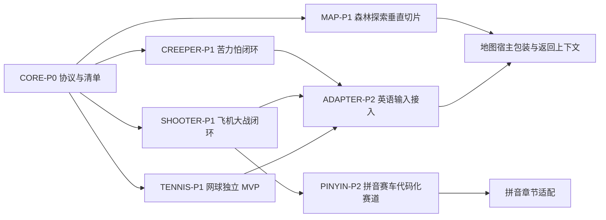

# 小游戏学习系统主控实施计划

> **主控说明：** 当前文档由主控线程维护。各执行线程只能修改自己负责的代码、任务文件和 `progress` 文件，不得直接修改本文件的总体目标、依赖关系和全局验收结论。

**目标：** 按现有小游戏、跨游戏宿主、卡片记忆系统和 RPG 探索地图方案，把四个学习游戏逐步改造成可独立运行、可被章节系统调用、可产生可解释学习证据的底层能力。

**架构：** 当前小游戏项目负责游戏运行时、输入、动画、赛道、战斗和单局结果；卡片式单词学习游戏记忆系统负责词卡、章节、复习、Profile、成长和奖励结算；像素农场/探索地图负责把结果包装成任务、区域和世界变化。任何游戏都不能直接决定章节解锁或掌握度。

**技术栈：** Vanilla JS、HTML、CSS、Canvas 2D、现有 Node.js 契约测试、本地静态服务、iframe/`postMessage` 宿主协议。

---

## 1. 主控范围

| 工作流 | 项目 | 执行线程 | 代码写入边界 | 依赖 |
| --- | --- | --- | --- | --- |
| 跨游戏底座 | 小游戏项目 | CORE | `host/`、`bridge.js`、共享 manifest、协议测试 | 无 |
| 苦力怕 | 小游戏项目 | CREEPER | `games/typing-defense/web/` 及专属测试 | CORE 协议可先用本地 fixture |
| 飞机大战 | 小游戏项目 | SHOOTER | `games/learning-arcade/` 中飞机模式与共享运行时 | CORE；优先处理共享文件 |
| 拼音赛车 | 小游戏项目 | PINYIN | 拼音专属模块、拼音数据、专属测试 | SHOOTER 先完成共享运行时边界 |
| 网球学英语 | 小游戏项目 | TENNIS | 新建 `games/tennis-english/`、专属测试和 manifest | CORE 协议；可先独立模式 |
| 探索地图 | 小游戏项目 | MAP | `games/explore-map/`、`games/word-memory-map/`、地图配置和专属测试 | CORE；不改小游戏内部逻辑 |
| 卡片系统适配 | 卡片式单词学习游戏记忆系统 | ADAPTER | `js/games/`、宿主适配器、fixture 和测试 | CORE 协议稳定后完成接入 |

### 1.1 共享文件禁改规则

- SHOOTER 是 `games/learning-arcade/game.js` 的唯一代码所有者；PINYIN 在共享运行时阶段只能提交设计、测试、manifest 和新建的拼音专属模块。
- CORE 是 `host/`、`bridge.js` 和跨游戏协议测试的唯一代码所有者。
- MAP 不得把章节、Profile、FSRS 或成长结算写入地图运行时。
- ADAPTER 不得通过修改游戏内部变量完成章节结算，只能使用宿主协议。
- 主控线程负责合并跨工作流文档、依赖状态和跑偏记录，不替代执行线程写业务代码。

## 2. 阶段和依赖



### P0：合同先行

- 创建或确认每个游戏的 `game-manifest.json`。
- 统一 `ready/init/card-result/complete/stop` 生命周期。
- 定义 `cardId`、`sessionId`、`gameId`、`domain`、`responseMode` 和错误标签。
- 为独立模式、宿主模式、刷新恢复和重复结果建立最小测试。

### P1：每个游戏有可验收的独立闭环

- 苦力怕：错误回馈、原题重试、错词复习和主动输入。
- 飞机大战：输入/移动分离、多目标输入、错误标签和短局。
- 网球学英语：表达选择、语境反馈和独立运行 MVP。
- 森林地图：探索、学习屋、活动、农场奖励和返回上下文。

### P2：共享运行时与外部宿主接入

- 拼音赛车迁移到代码化 Canvas 赛道。
- 卡片系统调用苦力怕、飞机大战和网球适配器。
- 探索地图通过宿主启动活动并恢复原节点。

### P3：长期内容与质量收束

- 外星错词探索、区域挑战和延迟复习包装。
- 语法之塔只在 `english-grammar` 或 `english-expression` 内容包具备后实施。
- AI 教练、XP、等级、连胜和勋章由卡片系统结算，游戏只提供事件。

## 3. 执行线程规则

每个线程开始前必须阅读：

- 自己工作流的 `plan/01-实施计划.md`。
- 自己工作流的 `task/01-任务清单.md`。
- 自己工作流的 `验收标准/01-验收矩阵.md`。
- 当前主控计划和相关架构文档。

每个线程完成一个任务后必须更新：

- `task/01-任务清单.md` 中的状态、证据和提交范围。
- `progress/01-执行日志.md` 中的时间、命令、结果、阻塞和下一步。
- `progress/00-当前状态.md` 中的摘要状态。

状态只允许使用：

```text
planned -> ready -> in_progress -> review -> verified -> complete
                              \-> blocked
```

`blocked` 必须写明阻塞原因、已尝试动作、需要谁决策；不能用“还没做”代替。

## 4. 主控检查节奏

主控每次跟踪线程时按以下顺序检查：

1. 读取线程 `progress/00-当前状态.md` 和最近日志。
2. 对照该线程验收矩阵逐项核对，不接受只有“已完成”的口头状态。
3. 查看线程工作树的文件清单和测试输出，确认没有越权修改。
4. 检查是否触碰共享文件或破坏其他工作流的协议。
5. 若通过，标记 `verified`；若只是代码完成但缺测试，保持 `review`。
6. 若跑偏，记录到主控进度并向线程发送纠偏任务，不直接覆盖线程改动。
7. 集成前运行全局测试、契约测试和涉及工作流的浏览器/手工验收。

## 5. 跑偏判定

出现以下任一情况，主控将线程标记为 `needs-redirection`：

- 游戏在宿主模式直接读取卡片系统源码或 Profile storage key。
- 游戏分数、连击、时长直接修改掌握度、复习间隔或章节解锁。
- 拼音卡被写入英语章节，或英语词卡被用于拼音题型。
- 只增加视觉、金币或速度，没有新增学习证据和错词出口。
- 删除独立模式、破坏现有入口或降低完整内容模式能力。
- 飞机大战和拼音赛车同时修改 `games/learning-arcade/game.js`。
- 用 AI 随机生成不可恢复的题目、答案或奖励。
- 任务目标变成“玩足多少分钟/点击多少次”，而非学习事件。

## 6. 全局完成门槛

只有同时满足以下条件，主控才会将本轮标记为完成：

- 所有工作流的独立模式可启动并完成一局。
- 宿主协议能够传入稳定卡片并收到一次性结果。
- 错误、提示、独立正确、延迟复习分别记录。
- 结果页具有复习错题、再玩和返回上下文出口。
- 森林、太空、外星地图使用统一路线节点和探索会话，不复制学习算法。
- `npm test`、相关专项测试和主控验收矩阵通过。
- 线程进度、任务状态、验收证据和剩余风险均已写入文档。

## 7. 详细工作流入口

- [跨游戏底座](./跨游戏底座/plan/01-实施计划.md)
- [苦力怕](./苦力怕/plan/01-实施计划.md)
- [飞机大战](./飞机大战/plan/01-实施计划.md)
- [拼音赛车](./拼音赛车/plan/01-实施计划.md)
- [网球学英语](./网球学英语/plan/01-实施计划.md)
- [探索地图](./探索地图/plan/01-实施计划.md)
- [卡片系统适配](./卡片系统适配/plan/01-实施计划.md)

